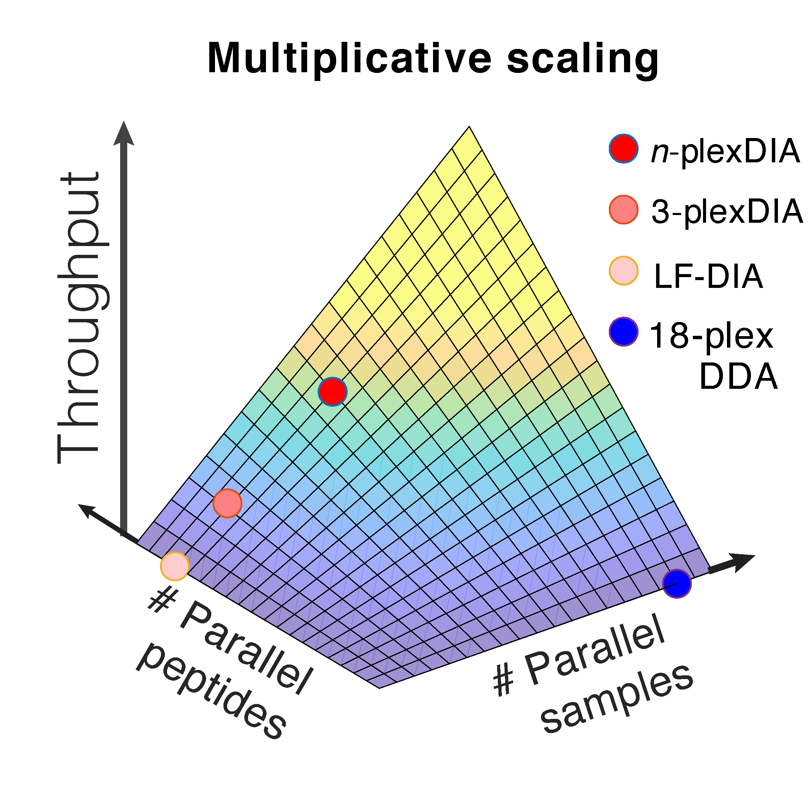



# plexDIA

## Parallelized single-cell proteomics method by [Derks et al, 2021](https://www.biorxiv.org/content/10.1101/2021.11.03.467007v2)
 * Code available at: [github.com/SlavovLab/plexDIA](https://github.com/SlavovLab/plexDIA)

## Data Websites
 * [Derks et al., 2022](https://scp.slavovlab.net/Derks_et_al_2022)

&nbsp;

plexDIA enables parallel analysis of both peptides and single cells, which allows for [multiplicative](https://doi.org/10.1101/2021.11.03.467007) increase of proteomics throughput. These advantages generalize to [bulk samples](https://plexDIA.slavovlab.net/) and to [single cells](https://scp.slavovlab.net/Derks_et_al_2022), resulting in 1,000 proteins / single cell using 5 min of active chromatography / cell.

&nbsp;

[{: width="90%" .center-image}](https://plexdia.slavovlab.net/)

&nbsp;

Current mass-spectrometry methods enable high-throughput proteomics of large sample amounts, but proteomics of low sample amounts remains limited in depth and throughput. To increase the throughput of sensitive proteomics, we developed an experimental and computational framework, plexDIA, for simultaneously multiplexing the analysis of both peptides and samples. Multiplexed analysis with plexDIA increases throughput multiplicatively with the number of labels without reducing proteome coverage or quantitative accuracy. By using 3-plex nonisobaric mass tags, plexDIA enables quantifying 3-fold more protein ratios among nanogram-level samples. When applied to single human cells, plexDIA quantified about 1,000 proteins per cell and achieved 98% data completeness within a plexDIA set while using about 5 min of active chromatography per cell. These results establish a general framework for increasing the throughput of sensitive and quantitative protein analysis.

---

[{: width="90%" .center-image}](https://plexdia.slavovlab.net/)

&nbsp;  

&nbsp;

&nbsp;  

&nbsp;

&nbsp;

&nbsp;

&nbsp;

&nbsp;

&nbsp;

&nbsp;

&nbsp;

&nbsp;

&nbsp;

&nbsp;

&nbsp;

&nbsp;

&nbsp;

&nbsp;
