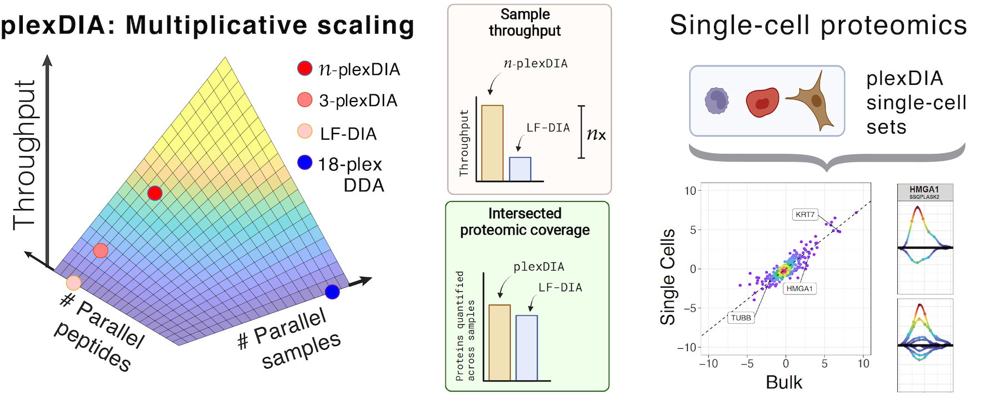



# plexDIA

## Parallelized single-cell proteomics method by [Derks et al, 2021](https://www.biorxiv.org/content/10.1101/2021.11.03.467007v2)
 * Code available at: [github.com/SlavovLab/plexDIA](https://github.com/SlavovLab/plexDIA) & [DIA-NN 1.8.1 release](https://github.com/vdemichev/DiaNN/releases/tag/1.8.1)
 * **Peer reviewed article:** Derks, J., Leduc, A., Wallmann, G. *et al.* Increasing the throughput of sensitive proteomics by plexDIA. *Nat Biotechnol*  (2022). [10.1038/s41587-022-01389-w](https://doi.org/10.1038/s41587-022-01389-w), [Research Briefing](https://www.nature.com/articles/s41587-022-01411-1)
  * **Perspective:**  Derks, J., Slavov N., [Increasing the depth and throughput of plexDIA](#plexdia-perspective)

## Data Websites
 * [Derks et al., 2022](https://scp.slavovlab.net/Derks_et_al_2022)

&nbsp;

plexDIA enables parallel analysis of both peptides and single cells, which allows for [multiplicative](https://doi.org/10.1101/2021.11.03.467007) increase of proteomics throughput. These advantages generalize to [bulk samples](https://plexDIA.slavovlab.net/) and to [single cells](https://scp.slavovlab.net/Derks_et_al_2022), resulting in 1,000 proteins / single cell using 5 min of active chromatography / cell.

&nbsp;

[{: width="90%" .center-image}](https://plexdia.slavovlab.net/)

&nbsp;

Current mass-spectrometry methods enable high-throughput proteomics of large sample amounts, but proteomics of low sample amounts remains limited in depth and throughput. To increase the throughput of sensitive proteomics, we developed an experimental and computational framework, plexDIA, for simultaneously multiplexing the analysis of both peptides and samples. Multiplexed analysis with plexDIA increases throughput multiplicatively with the number of labels without reducing proteome coverage or quantitative accuracy. By using 3-plex nonisobaric mass tags, plexDIA enables quantifying 3-fold more protein ratios among nanogram-level samples. When applied to single human cells, plexDIA quantified about 1,000 proteins per cell and achieved 98% data completeness within a plexDIA set while using about 5 min of active chromatography per cell. These results establish a general framework for increasing the throughput of sensitive and quantitative protein analysis.

---

&nbsp;

<iframe width="560" height="315" src="https://www.youtube.com/embed/GWHzvHGvUTg" title="YouTube video player" frameborder="0" allow="accelerometer; autoplay; clipboard-write; encrypted-media; gyroscope; picture-in-picture" allowfullscreen></iframe>

---

&nbsp;

[{: width="80%" .center-image}](https://plexdia.slavovlab.net/) | [DIA-NN 1.8.1 on Github](https://github.com/vdemichev/DiaNN/releases/tag/1.8.1){: .fs-5} | [Research Briefing](https://www.nature.com/articles/s41587-022-01411-1){: .fs-5}

--------

&nbsp;

## plexDIA Perspective

Derks, J., Slavov N., Strategies for increasing the depth and throughput of protein analysis by plexDIA, *bioRxiv* (2022). [10.1101/2022.11.05.515287](https://doi.org/10.1101/2022.11.05.515287)
 * [Code @ GitHub](https://github.com/SlavovLab/plexDIA_perspective)
 * [Data @ massIVE](https://massive.ucsd.edu/ProteoSAFe/dataset.jsp?task=6f609a85f7e24961bf6af1c592c2277d)

Accurate protein quantification is key to identifying protein markers, regulatory relationships between proteins, and pathophysiological mechanisms. Realizing this potential requires sensitive and deep protein analysis of a large number of samples. Toward this goal, proteomics throughput can be increased by parallelizing the analysis of both precursors and samples using multiplexed data independent acquisition (DIA) implemented by the plexDIA framework. Here we demonstrate the improved precisions of RT estimates within plexDIA and how this enables more accurate protein quantification. plexDIA has demonstrated multiplicative gains in throughput, and these gains may be substantially amplified by improving the multiplexing reagents, data acquisition and interpretation. We discuss future directions for advancing plexDIA, which include engineering optimized mass-tags for high-plexDIA and developing algorithms that utilize the regular structures of plexDIA data to improve sensitivity, proteome coverage and quantitative accuracy. These advances in plexDIA will increase the throughput of functional proteomic assays, including quantifying protein conformations, turnover dynamics, modifications states and activities. The sensitivity of these assays will extend to single-cell analysis, thus enabling functional single-cell protein analysis.

&nbsp;  

&nbsp;

&nbsp;  

&nbsp;

&nbsp;

&nbsp;

&nbsp;

&nbsp;

&nbsp;

&nbsp;

&nbsp;

&nbsp;

&nbsp;

&nbsp;

&nbsp;

&nbsp;

&nbsp;

&nbsp;
