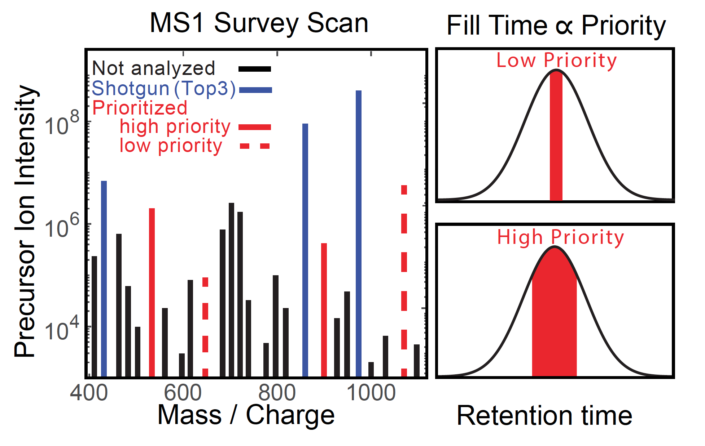
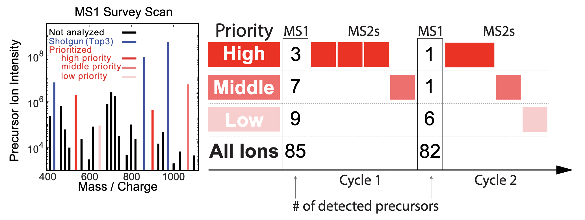



# pSCoPE

## Prioritized single-cell proteomics method by [Huffman et al, 2022][pSCoPE_Preprint]
 * Code available at: [github.com/SlavovLab/pSCoPE](https://github.com/SlavovLab/pSCoPE)
 * **Peer reviewed article:** Huffman RG, Leduc A, Wichmann C, ... and Slavov N, [Prioritized mass spectrometry increases the depth, sensitivity and data completeness of single-cell proteomics][pSCoPE_Nature-Methods]. *Nat Methods*, doi: [10.1038/s41592-023-01830-1](https://doi.org/10.1038/s41592-023-01830-1) (2023)
  * **Research Briefing:** [Extending the sensitivity, consistency and depth of single-cell proteomics](https://www.nature.com/articles/s41592-023-01786-2), [OA](https://rdcu.be/c9aAL)

## Data Websites
 * [Huffman et al., 2022](Huffman_et_al_2022)
 * [Leduc et al., 2022](Leduc_et_al_2022)

 <!-- [{: width="50%" .center-image}][pSCoPE_Preprint] -->
 [{: width="80%" .center-image}][pSCoPE_Preprint]

&nbsp;

Major aims of single-cell proteomics include increasing the consistency, sensitivity, and depth of protein quantification, especially for proteins and modifications of biological interest. To simultaneously advance all of these aims, we developed prioritized Single Cell ProtEomics (pSCoPE). pSCoPE ensures duty-cycle time for analyzing prioritized peptides across all single cells (thus increasing data consistency) while analyzing identifiable peptides at full duty-cycle, thus increasing proteome depth. These strategies increased the quantified data points for challenging peptides and the overall proteome coverage about 2-fold.

---

&nbsp;

## Implementation
pSCoPE is implemented as a module of MaxQuant.Live, starting with [version 2.1](http://www.maxquant.live) and is compatible with Thermo Fisher Q-Exactive series, Orbitrap Exploris as well as Orbitrap Eclipse.  All additional code needed for pSCoPE and reproducing [Huffman et al., 2022][pSCoPE_Preprint] is available at [github.com/SlavovLab/pSCoPE](https://github.com/SlavovLab/pSCoPE). Try it out and give us feedback!

&nbsp;  

&nbsp;

<iframe width="560" height="315" src="https://www.youtube.com/embed/SP0x3gAALtg" title="YouTube video player" frameborder="0" allow="accelerometer; autoplay; clipboard-write; encrypted-media; gyroscope; picture-in-picture" allowfullscreen></iframe>

&nbsp;  

&nbsp;

&nbsp;

&nbsp;

&nbsp;

[pSCoPE_Preprint]: https://www.biorxiv.org/content/10.1101/2022.03.16.484655v2 "Prioritized Single Cell ProtEomics by Mass-Spectrometry enables high-throughput targeted proteomics"

[pSCoPE_Nature-Methods]: https://www.nature.com/articles/s41592-023-01830-1 "Prioritized mass spectrometry increases the depth, sensitivity and data completeness of single-cell proteomics"

&nbsp;

&nbsp;

&nbsp;

&nbsp;

&nbsp;

&nbsp;

&nbsp;

&nbsp;

&nbsp;

&nbsp;

&nbsp;
