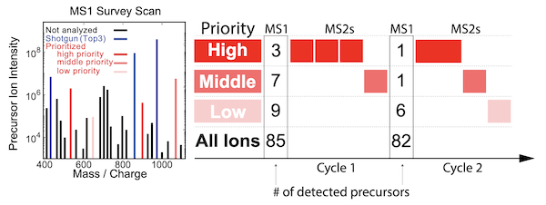



# QuantQC

## Quantitative evaluation and processing pipeline by [Leduc et al, 2023][QuantQC_Preprint]
 * Code available at: [github.com/SlavovLab/QuantQC](https://github.com/SlavovLab/QuantQC)
 * **Preprint article:** Leduc A, Luke Khoury, Joshua Cantlon, Slavov N. (2023)
Massively parallel sample preparation for multiplexed single-cell proteomics using nPOP, *bioRxiv*, doi: [10.1101/2023.11.27.568927](https://doi.org/10.1101/2023.11.27.568927)  
* **Peer-reviewed article:** Leduc A, Luke Khoury, Joshua Cantlon, Slavov N. (2024)
Massively parallel sample preparation for multiplexed single-cell proteomics using nPOP, *Nature Protocols*, doi: [10.1038/s41596-024-01033-8](https://doi.org/10.1038/s41596-024-01033-8)

<!--
[{: width="50%" .center-image}][pSCoPE_Preprint]
 [{: width="80%" .center-image}][pSCoPE_Preprint]-->

 &nbsp;

 &nbsp;

 [{: width="50%" .center-image}](https://github.com/SlavovLab/QuantQC)

&nbsp;

QuantQC is an R package for evaluation, benchmarking and processing of single-cell proteomics data, especially data from experiments using [nPOP](nPOP). It
can be used to map all metadata and generate quality reports for quick evaluation of
the experiment. QuantQC generates HTML reports for evaluating nPOP sample preparation, stability of
data acquisition, and quantification performance that can be easily shared with
colleagues. QuantQC also facilitates exploratory data analysis such as visualizing
agreement between peptides mapping to the same protein across clusters.

---

&nbsp;

## Implementation
QuantQC is available as an R package from [github.com/SlavovLab/QuantQC](https://github.com/SlavovLab/QuantQC). Try it out and give us feedback!

&nbsp;  

&nbsp;

&nbsp;  

&nbsp;

&nbsp;

&nbsp;

&nbsp;

[QuantQC_Preprint]: https://www.biorxiv.org/content/10.1101/2023.11.27.568927v1 "software package and metrics for quality control that can support the robust scaling of nPOP to higher plex reagents for achieving reliable high-throughput single-cell protein analysis."

&nbsp;

&nbsp;

&nbsp;

&nbsp;

&nbsp;

&nbsp;

&nbsp;

&nbsp;

&nbsp;

&nbsp;

&nbsp;
