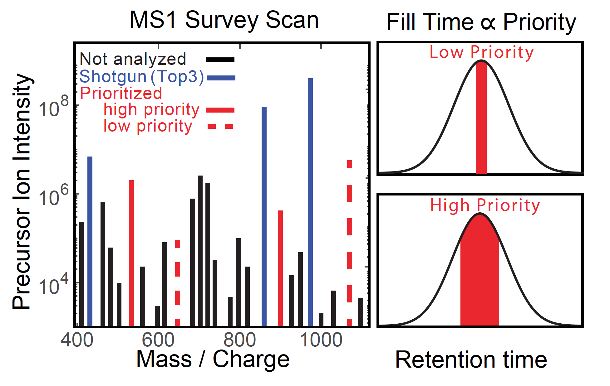
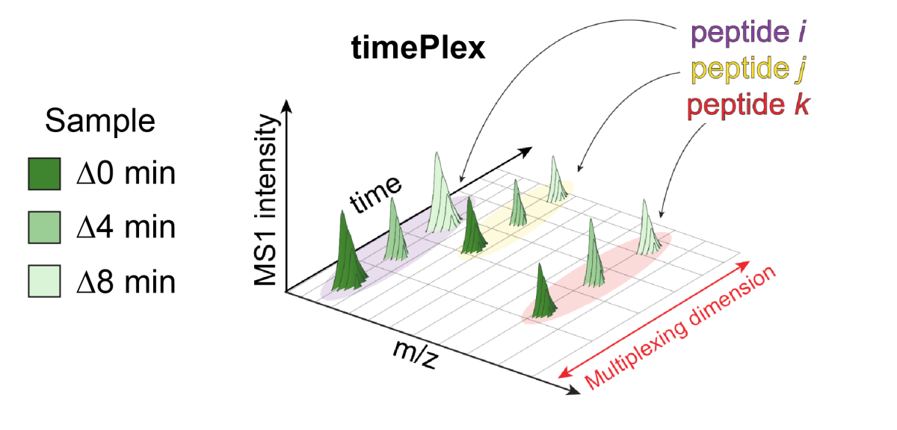



# timePlex

## Time-encoded sample multiplexing method by [Derks et al, 2025][timePlex_Preprint]
 * timePlex is developed at Parallel Squared Technology Institute: [parallelsq.org/timeplex](https://www.parallelsq.org/timeplex)
 * Code available at: [github.com/ParallelSquared/timePlex](https://github.com/ParallelSquared/timePlex)
 <!--
 * **Peer reviewed article:** Huffman RG, Leduc A, Wichmann C, ... and Slavov N, [Prioritized mass spectrometry increases the depth, sensitivity and data completeness of single-cell proteomics][pSCoPE_Nature-Methods]. *Nat Methods*, doi: [10.1038/s41592-023-01830-1](https://doi.org/10.1038/s41592-023-01830-1) (2023)
  * **Research Briefing:** [Extending the sensitivity, consistency and depth of single-cell proteomics](https://www.nature.com/articles/s41592-023-01786-2), [OA](https://rdcu.be/c9aAL)

## Data Websites
 * [Huffman et al., 2022](Huffman_et_al_2022)
 * [Leduc et al., 2022](Leduc_et_al_2022)
 * [Leduc et al., 2023](Leduc_et_al_2023)
 * [Leduc et al., 2024](Leduc_et_al_2024)
 * [Khan, Elcheikhali et al, 2024](Khan_Elcheikhali_et_al_2024)
 -->

 <!-- [{: width="50%" .center-image}][pSCoPE_Preprint] -->
 [{: width="80%" .center-image}][https://slavovlab.net/PTI-Publications/2025_Derks_timePlex.pdf]

&nbsp;

The throughput of LC-MS can be increased by multiplexing samples in the mass domain with [plexDIA](plexDIA), yet multiplexing along one dimension will scale throughput only linearly with plex. Combinatorial-scaling can be achieved by a complementary multiplexing strategy in the time domain, termed ‘timePlex’. timePlex staggers and overlaps the separation periods of individual samples. This strategy is orthogonal to isotopic multiplexing, which enables combinatorial multiplexing in mass and time domains when paired together, and thus multiplicatively increased throughput. timePlex was developed at PTI.

---

&nbsp;

<!--

## Implementation
pSCoPE is implemented as a module of MaxQuant.Live, starting with [version 2.1](http://www.maxquant.live) and is compatible with Thermo Fisher Q-Exactive series, Orbitrap Exploris as well as Orbitrap Eclipse.  All additional code needed for pSCoPE and reproducing [Huffman et al., 2022][pSCoPE_Preprint] is available at [github.com/SlavovLab/pSCoPE](https://github.com/SlavovLab/pSCoPE). Try it out and give us feedback!

&nbsp;  

&nbsp;

-->

<iframe width="560" height="315" src="https://www.youtube.com/embed/SP0x3gAALtg" title="YouTube video player" frameborder="0" allow="accelerometer; autoplay; clipboard-write; encrypted-media; gyroscope; picture-in-picture" allowfullscreen></iframe>

&nbsp;  

&nbsp;

&nbsp;

&nbsp;

&nbsp;

[timePlex_Preprint]: https://doi.org/10.1101/2025.05.22.655515 "timePlex: Increasing mass spectrometry throughput using time-encoded sample multiplexing"

[pSCoPE_Nature-Methods]: https://www.nature.com/articles/s41592-023-01830-1 "Prioritized mass spectrometry increases the depth, sensitivity and data completeness of single-cell proteomics"

&nbsp;

&nbsp;

&nbsp;

&nbsp;

&nbsp;

&nbsp;

&nbsp;

&nbsp;

&nbsp;

&nbsp;

&nbsp;
