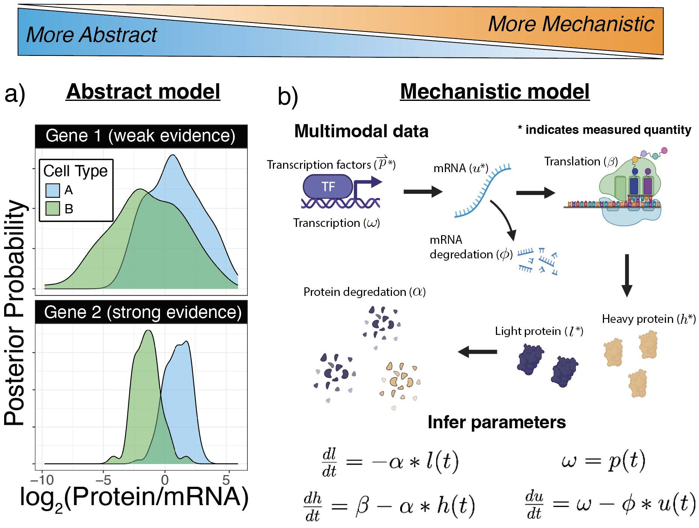



# Multimodal analysis

<!--
{: .fs-9 }
Proteome biology
{: .fs-6 .fw-300}
-->

&nbsp;

Single-cell multimodal analysis techniques have also opened new opportunities for analyzing biological systems, such as quantifying [post-transcriptional regulation](https://doi.org/10.1371/journal.pcbi.1005535) at single-cell resolution.

This section is devoted to methods that combine single-cell protein analysis with other omics analysis, such as single-cell RNA-seq.

&nbsp;

[{:width="80%" .center-image}](https://slavovlab.net/Slavov-Lab-Publications/2023_Proteogenomics.pdf)

[Modeling and interpretation of single-cell proteogenomic data](https://arxiv.org/abs/2308.07465),  doi: [10.48550/arXiv.2308.07465](https://doi.org/10.48550/arXiv.2308.07465)

<!--

## Funding support
The research reported here has been supported by funding from the [NIH Director's Award](https://projectreporter.nih.gov/project_info_description.cfm?aid=9167004&icde=31336575) by an [Allen Distinguished Investigator Award](https://alleninstitute.org/what-we-do/frontiers-group/distinguished-investigators/projects/tracking-proteome-dynamics-single-cells) from the Paul G. Allen Frontiers Group and by [CZI](https://chanzuckerberg.com/science/programs-resources/single-cell-biology/seednetworks/mapping-the-transcriptome-and-proteome-of-human-testis-in-3d/).

-->

 &nbsp;

 &nbsp;

 &nbsp;  
